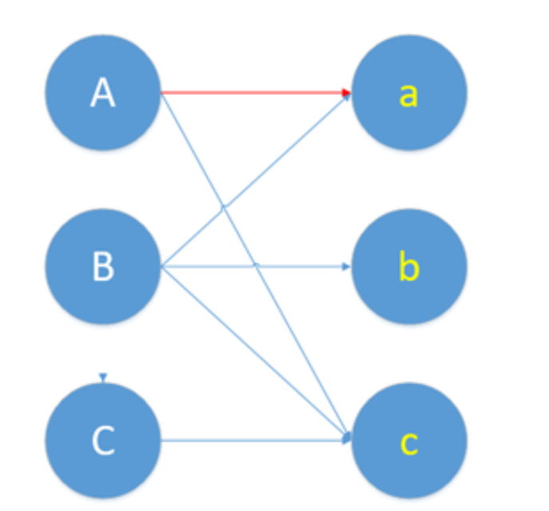
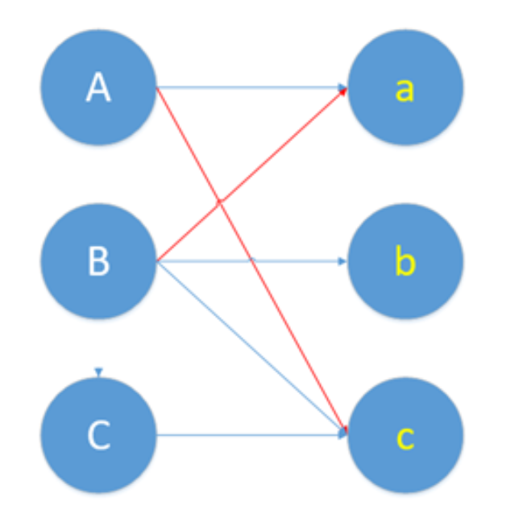
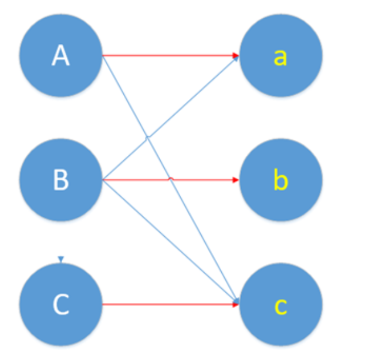

# 学习日记-mc64（6）
## 复现算法整体流程+开会讨论相关信息
### **算法整体流程**
* HWPM (heavy-weight perfect matching)算法是由三种匹配算法组成的。极大（Maximal）基数匹配，最大（Maximum）基数匹配，大权重完美匹配。
* **极大基数匹配**：简单来说就是二分图的初始化连线，有冲突的就跳过，使用贪心算法

* **最大（Maximum）基数匹配**，寻找增广路的过程:
  * 初始化：从未匹配顶点（即未包含在当前匹配中的顶点）开始。通常，未匹配顶点被标记为"未访问"，并将它们添加到一个候选队列或堆栈中。
  * 路径扩展：从候选队列或堆栈中选择一个未匹配顶点作为起始点，然后尝试扩展路径。路径扩展的规则如下：
    * 从起始点出发，选择一条未匹配边（如果有的话），连接到另一个节点。
然后，从该节点出发，选择一条匹配边，连接到另一个节点。
    * 重复以上步骤，交替选择未匹配边和匹配边，直到达到一个未匹配顶点。
  * 路径标记：标记路径上的所有边，通常标记未匹配边为"匹配"，标记匹配边为"未匹配"。这相当于翻转路径中的边的匹配状态。
  * 路径返回：返回到起始点，从起始点再次尝试路径扩展，直到无法找到增广路径为止。
  * 查找结束：查找过程结束，如果找到了增广路径，就将它们添加到匹配中，从而增加匹配的基数。如果没有找到增广路径，就意味着当前匹配已经是最大基数匹配，查找结束。
  * 查找增广路径的过程通过反复查找交替路径，以寻找未匹配顶点之间的路径，从而改变匹配状态。
<figure>

</figure>

* 非匹配边） (匹配边) (非匹配边)
B--------------a----------------A-----------------c
* （匹配边） (非匹配边) (匹配边)
B--------------a----------------A-----------------c
* （非） （匹） （非） （匹） （非）
C--------c-----------A----------a----------B---------b
* （匹） （非） （匹） （非） （匹）
C--------c-----------A----------a----------B---------b
* **存在问题**：第三篇的实现论文中，使用了启发式的算法，我们代码需要后续更改，理论上可以提高性能
* 
* 在最大（Maximum）基数匹配中，论文中使用的是BFS增广，代码中还需确定是否为BFS增广
* **大权重完美匹配**
论文还没看，后续添加
### **开会讨论**
* 有关perm验证问题

* metis使用指导

### **下一步工作**
1. 通过metis验证perm正确性
2. 加入启发式算法
3. openmp+mpi